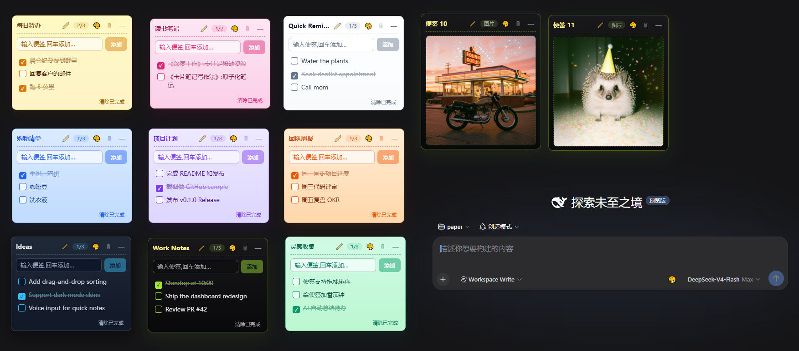
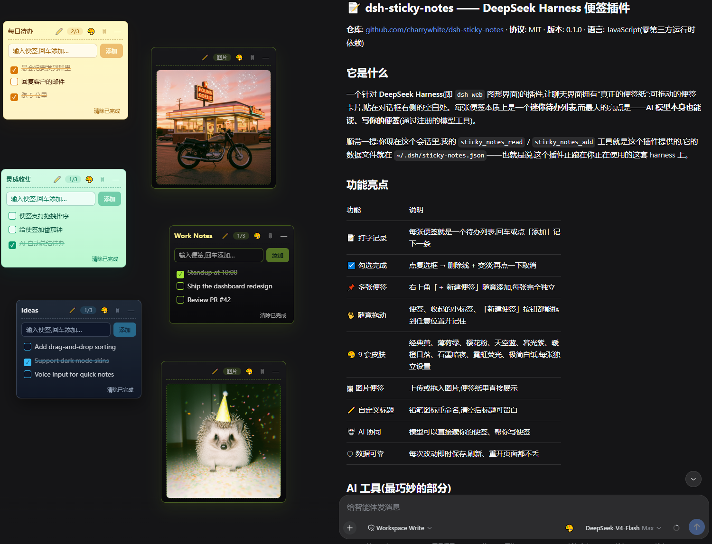
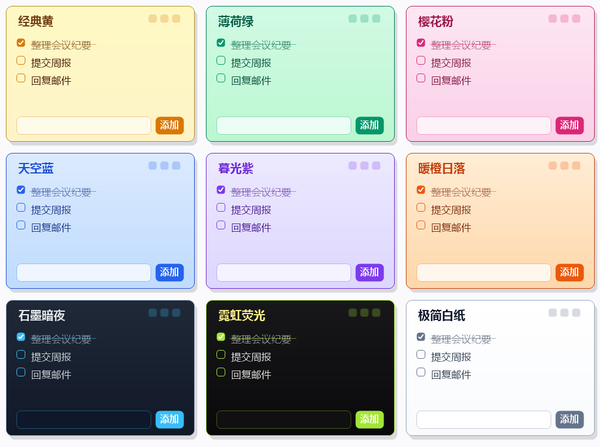

<h1 align="center">📝 Sticky Notes for DSH</h1>

<p align="center">
  <a href="README.md">中文</a> · <strong>English</strong>
</p>

<p align="center">
  <strong>Real sticky notes for DeepSeek Harness</strong><br />
  <sub>Draggable · Checkable todos · 9 skins · Image notes · AI read &amp; write</sub>
</p>

<p align="center">
  <a href="https://github.com/charrywhite/dsh-sticky-notes/stargazers"></a>
  <a href="./LICENSE"></a>
  <a href="https://github.com/charrywhite/dsh-sticky-notes/releases"></a>
  <a href="https://github.com/charrywhite/dsh-sticky-notes"></a>
</p>

<p align="center">
  
</p>

<p align="center">
  
</p>

<br />

## Highlights

<table>
<tr>
<td width="50%">

### 📝 Type to record

Each note is a todo list — press Enter or click Add to jot something down.

</td>
<td width="50%">

### 🤖 AI integration

The DeepSeek model can directly **read** your notes and **write** for you (see [§3](#3-ai-model-read--write)).

</td>
</tr>
<tr>
<td width="50%">

### ☑️ Check off

Tick the checkbox to strike through and dim an item; click again to undo.

</td>
<td width="50%">

### 📌 Multiple notes

Hit the "＋ New Note" button in the top-right corner to add as many as you like — each one fully independent.

</td>
</tr>
<tr>
<td width="50%">

### 🖐 Draggable

Notes, collapsed chips, and the New Note button can be dragged anywhere; positions are remembered.

</td>
<td width="50%">

### 🎨 9 skins

Classic Yellow, Mint Green, Sakura Pink, Sky Blue, Twilight Violet, Sunset Orange, Graphite Dark, Neon Glow, Minimal Paper — set per note.

</td>
</tr>
<tr>
<td width="50%">

### 🖼 Image notes

Upload or drop an image into a note; click it to replace it.

</td>
<td width="50%">

### ✏️ Custom titles

Rename with the ✏️ pencil icon; clear it for a blank title.

</td>
</tr>
<tr>
<td colspan="2">

### 🛡 Reliable storage

Every change is saved instantly — notes survive refresh and page reloads.

</td>
</tr>
</table>

## Skins

<p align="center">
  
</p>
<p align="center"><sub>Classic Yellow · Mint Green · Sakura Pink · Sky Blue · Twilight Violet · Sunset Orange · Graphite Dark · Neon Glow · Minimal Paper</sub></p>

---

## 1. Installation

> Prerequisite: `dsh` (DeepSeek Harness CLI) available on your machine. If `pnpm` is not on PATH, run `npm i -g pnpm` (or `corepack enable pnpm`) first.

### Option A: One-command install (recommended)

```powershell
# Install from GitHub
dsh plugin --profile web add github:charrywhite/dsh-sticky-notes

# Or install from a local directory during development (link resolves automatically)
dsh plugin --profile web add link:C:/path/to/dsh-plugin-sticky-notes
```

After installing:

1. **Restart dsh web** (Ctrl+C in the terminal that runs it, then run `dsh web` again)
2. **Hard-refresh the browser page** (Ctrl+F5) — the notes will appear on the right

To uninstall: `dsh plugin --profile web remove dsh-sticky-notes`

### Option B: Manual install (alternative)

Put the plugin folder anywhere (example below uses `C:\path\to\dsh-plugin-sticky-notes`), then edit your web profile config:

**① Register the dependency and bundle**

Edit `%USERPROFILE%\.dsh\profiles\web\package.json`:

```json
{
  "dependencies": {
    "dsh-sticky-notes": "link:C:/path/to/dsh-plugin-sticky-notes"
  },
  "dsh": {
    "profile": {
      "bundles": [
        "@deepseek-ai/dsh-base",
        "@deepseek-ai/dsh-web-app",
        "dsh-sticky-notes"
      ]
    }
  }
}
```

> `link:` points to the absolute path of the plugin folder; both `/` and `\` work (use `/` in JSON).

**② Run pnpm install in the profile directory**

```powershell
cd "$env:USERPROFILE\.dsh\profiles\web"
pnpm install
```

**③ Restart dsh web and hard-refresh the browser page** (Ctrl+F5).

### Option C: Manual install from GitHub

Write the dependency as a GitHub reference in `package.json`, then run `pnpm install` + restart + refresh:

```json
{
  "dependencies": {
    "dsh-sticky-notes": "github:charrywhite/dsh-sticky-notes#commit-hash-or-branch"
  },
  "dsh": {
    "profile": {
      "bundles": ["dsh-sticky-notes"]
    }
  }
}
```

---

## 2. Usage

### Creating notes

Click the 📝 **notes button** in the top-right corner and pick:

| Option | Description |
|--------|-------------|
| 📝 Text note | type in the input box; press Enter or click "Add" to turn it into a todo item |
| 🖼 Image note | click the upload area to pick an image, or drop one into the note |

New notes stack from the top-right corner by default; each has a title bar, a count badge, and action buttons.

### Note operations

| Action | How |
|--------|-----|
| Drag | hold the **title bar** (or the collapsed chip / 📝 button) and drag; the position is remembered |
| Hide/show all | tap the 👁 button below the 📝 button: all notes hide at once (icon becomes 🙈); tap again to restore (state is remembered) |
| Check off | click the checkbox left of an item → strikethrough + dim; click again to undo |
| Delete an item | hover the item, click the `×` on the right |
| Clear done | "Clear done" button at the bottom of the note clears all checked items at once |
| Change skin | click 🎨 in the title bar, pick from 9 color swatches (per note) |
| Rename | click ✏️ in the title bar, type a new name, Enter/blur to save; clear it for no title |
| Collapse/expand | click `—` in the title bar or simply click the title to collapse into a chip; click the chip to expand |
| Delete the note | click 🗑 in the title bar (with a confirmation dialog) |

### Image notes

- The uploaded image is shown inside the note; click it to replace it
- Image notes support dragging, skins, renaming, collapsing and deletion too

---

## 3. AI model read & write

The plugin registers two model tools that the DeepSeek model can call directly in the conversation:

### Read: `sticky_notes_read`

Lists all notes: title, each item's text, completion status (☐/☑), skin, and whether collapsed. Image notes show metadata only (title / whether an image exists).

**Usage**: tell the model "take a look at my notes", "help me organize my notes", or "work from my notes".

### Write: `sticky_notes_add`

- **Create a note**: omit `noteId`, pass `text` (required) + optional `title`
- **Append an item**: pass `noteId` (get it via `sticky_notes_read` first) + `text`

**Design constraint**: append/create only — existing content can never be modified or deleted, so the model can't clobber what you wrote by hand; image notes reject text items.

**Usage**: tell the model "add a note: meeting at 3 pm tomorrow" or "put this requirement on my work note".

---

## 4. Uninstall

1. Installed via Option A: `dsh plugin --profile web remove dsh-sticky-notes`
2. Installed via Option B/C: remove the dependency and the bundles entry from `package.json`, then run `pnpm install`
3. (Optional) delete the data file: `Remove-Item "$env:USERPROFILE\.dsh\sticky-notes.json"`
4. Restart dsh web

---

## Requirements

- DeepSeek Harness **web mode** (`dsh web`)
- Browser: modern Chromium / Firefox / Safari
- No third-party runtime dependencies

## Credits

Thanks to [@scraed](https://github.com/scraed) for the interaction designs proposed in [PR #1](https://github.com/charrywhite/dsh-sticky-notes/pull/1): the home key (tap to hide/show all notes, long-press to create) and tap-the-title-to-collapse.

## License

MIT
